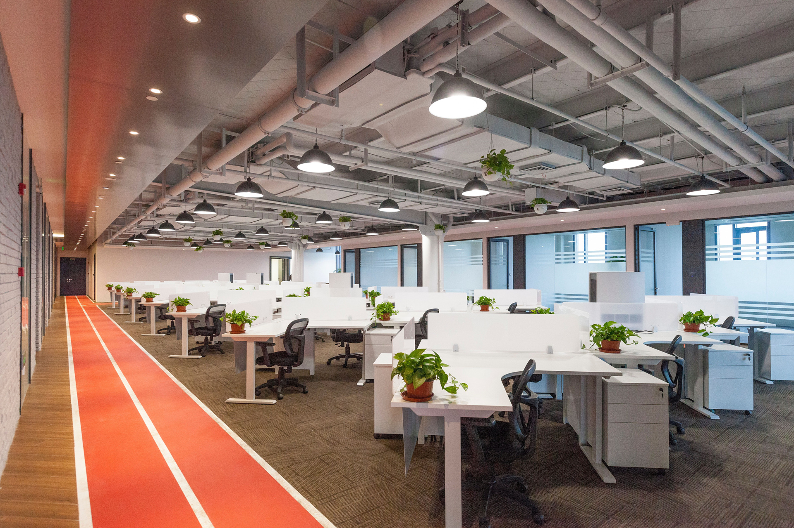
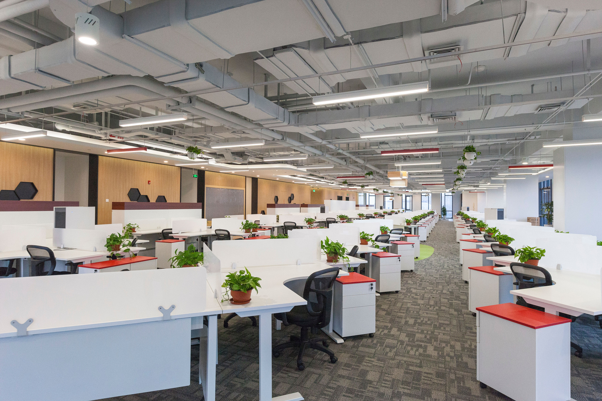
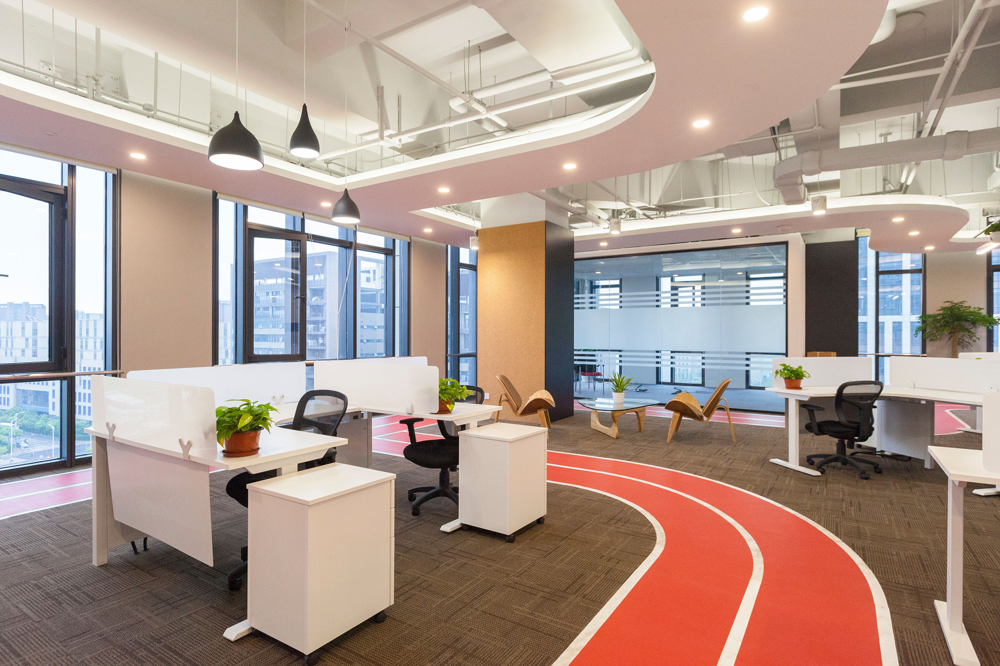
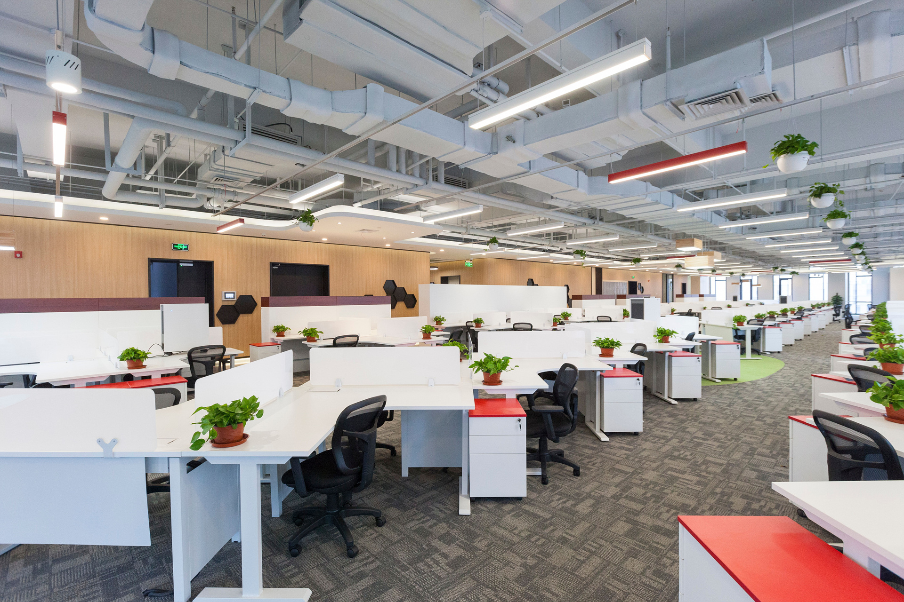
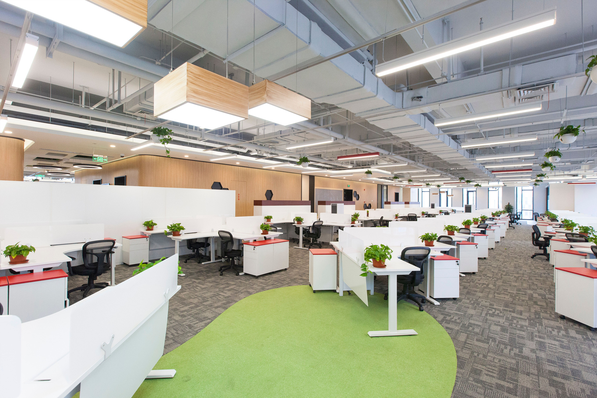
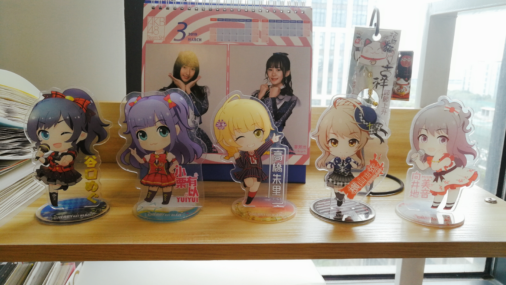
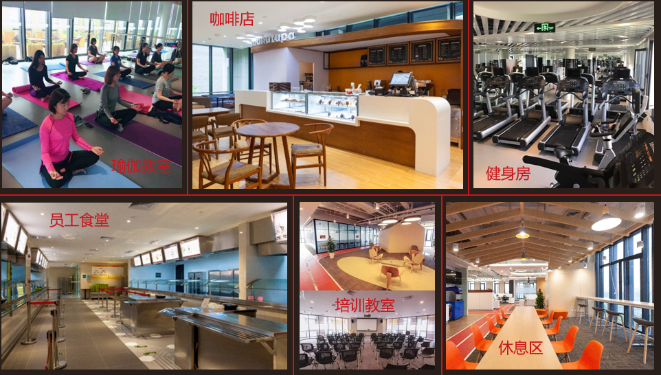

# 盛趣游戏
- [官网地址](http://www.shengqugames.com/cn/index)

# 公司简介INTRODUCTION

盛趣游戏是全球领先的网络游戏开发商、运营商和发行商。立足“科技赋能文化”的新文化产业定位，盛趣游戏全面推进“精品化”、“全球化”、“新文化”三大战略，以科技为骨、文化为翼，用科技激活文化的精髓，致力于成为一家打造极致互动体验的科技文化企业。

2001年，盛趣游戏运营《热血传奇》，创下当时全球大型多人在线游戏运营纪录，开创了中国网络游戏时代；2005年，首创免费模式，引领了全球游戏行业模式变革。

作为中国游戏产业开创者与变革者，盛趣游戏不断精进游戏品质，先后推出和运营了《热血传奇》、《传奇世界》、《泡泡堂》、《龙之谷》、《最终幻想14》等70多款精品游戏，注册用户超过21亿。
进入移动游戏时代，盛趣游戏先后成功发行代理游戏《扩散性百万亚瑟王》与推出自研游戏《热血传奇手机版》、《传奇世界手游》、《龙之谷手游》、《光明勇士》等现象级作品。

2019年3月31日起，正式启用“盛趣游戏”作为全新的品牌标识，以全新的理念与姿态，探索极限科技，构建新文化产业的绿色生态，把优秀的中国文化带向全球。

## 公司大楼
 
 

## 办公环境

## 公司福利

# 岗位介绍
## 校招/实习
- [校招官网](https://app.mokahr.com/campus_apply/shengqu/4078)

2020年秋招内推将在2019年7月开启，可关注“盛趣游戏招聘”公众号获取最新消息。

 
微信：youyou19960810（加好友备注github）

## 社招
- [社招官网](https://app.mokahr.com/apply/shengqu/4077#/?_k=gsske3)

投递简历后，HR小姐姐将根据您过往项目经验进行筛选并推荐合适的项目组。筛选通过后我们将致电沟通具体岗位及项目情况，以及邀约面试。3个工作日内即可获得反馈！
### 岗位/项目咨询：
#### 服务器招聘HR联系方式
QQ：1738677801（加好友备注github）

#### 客户端招聘HR联系方式
QQ：404228085（加好友备注github）

# 面试流程
实习生基本上只有一轮技术面及一轮HR面试，
校招面试是两轮技术面加上一轮HR面试。
业务面试根据不同岗位不同职级评定，每轮面试结果基本隔天会给到答复。
# 简历投递方式
### PC端：可在官网上直接投递并上传简历附件
### 微端：关注“盛趣游戏招聘”公众号在子菜单内进行查阅并投递
### 邮箱咨询：<hr@shengqugames.com >

 
